

第三次作业 

姓名：张晟 
班级：自动化64 
学号：2160504107 
提交日期：2019/3/19 

## 摘要：
  本次作业与直方图关系密切，说明了直方图在数字图像处理中的重要作用。本次作业运用了计算直方图，直方图均衡化，直方图匹配，局部直方图增强和图像分割，并分析了处理效果，对于使用直方图的相关方法处理图像有了一定的了解。

### 第一题
#### 题目描述
  把附件图像的直方图画出；
#### 分析：
  本题目考察图像的直方图的定义，首先将一幅图片转换为灰度图像，k=8，每个像素都有0-255这256种值。统计每种像素值的个数并以直方图的形式画出，就是图像的直方图。查阅相关资料后，了解到matlab的imhist函数能够方便的画出图像的直方图。
#### 结果
  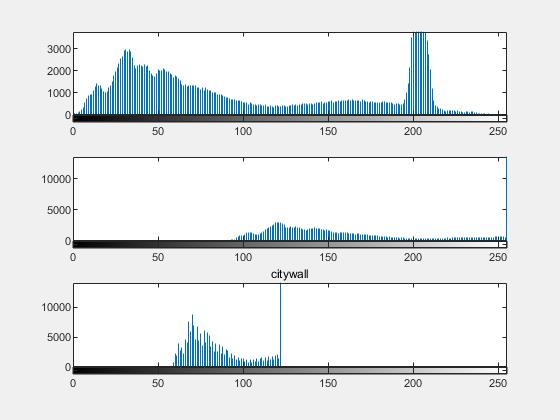

  从上到下依次是citywall，citywall1，citywall2

  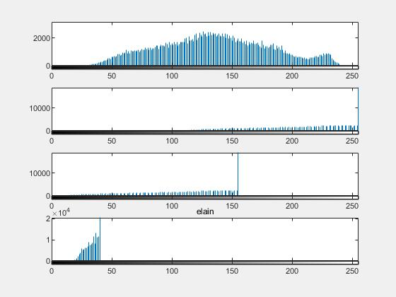

  从上到下依次是elain，elain1，elain2，elain3

  

  从上到下依次是lena，lena1，lena2，lena3

  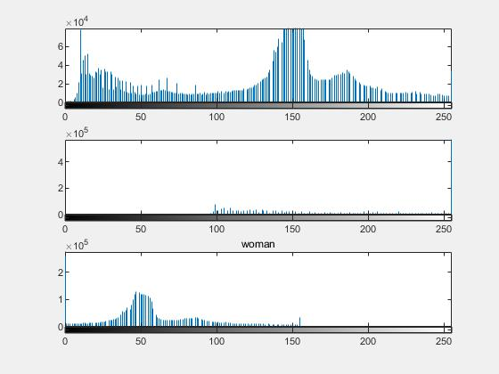

  从上到下依次是woman，woman1，woman2

#### 结果分析

  从结果上看，对图像的感受与图像的直方图有很大关系。例如citywall和citywall1二者基本是反色关系，从直方图来看citywall频数较低的部分恰好是citywall1频数较高的部分，citywall2的整体色调较citywall更为暗淡，因此citywall2的直方图分布区域小于citywall。直方图分布越集中则对比度越低，越分散则对比度越高。

### 第二题

#### 题目描述

  把所有图像进行直方图均衡；输出均衡后的图像和源图像进行比对；分析改善内容；

#### 分析

  直方图均衡化是通过构造一种非线性变换方式，对原图像的每个像素值进行变换。原图像的直方图可能仅在一部分灰度区间内有值，经过直方图均衡化后，整个灰度空间都有值，且近似为一个常数。直方图均衡化可用matlab的histeq函数进行变换

#### 结果

从上到下，从左到右，以次为原图像，直方图均衡化后的图像，原图像直方图，均衡化后的直方图

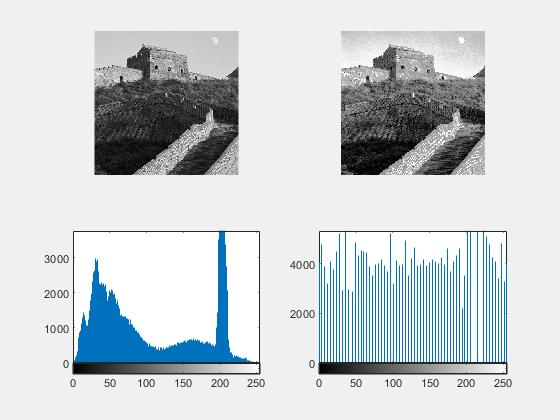

citywall

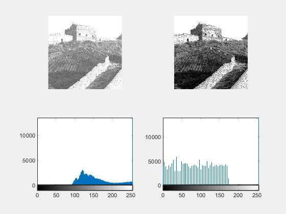

citywall1

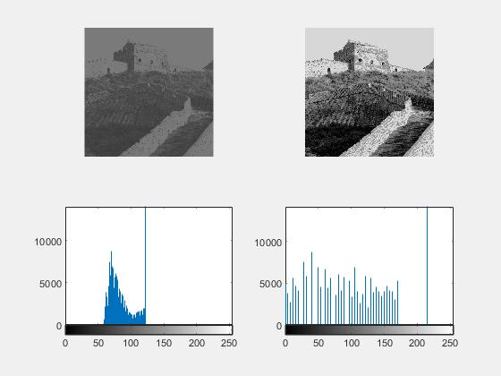

citywall2

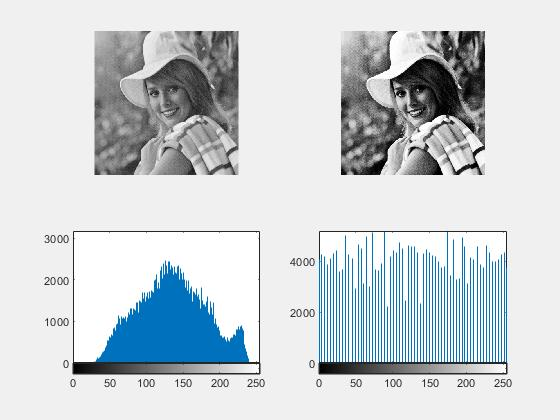

elain

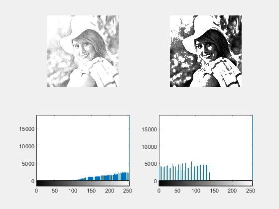

elain1

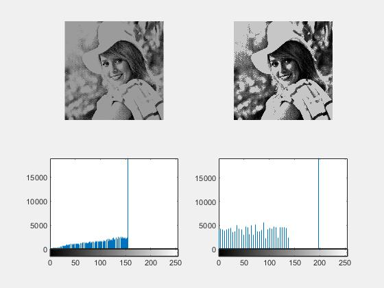

elain2

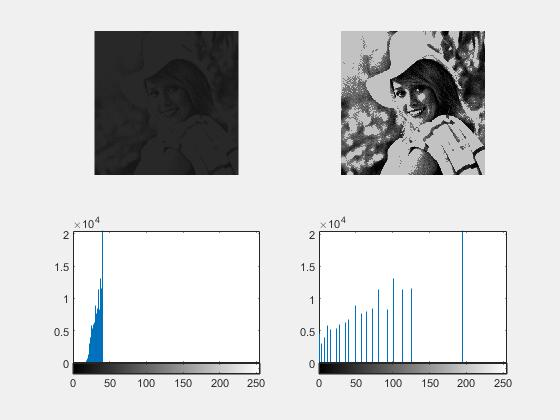

elain3

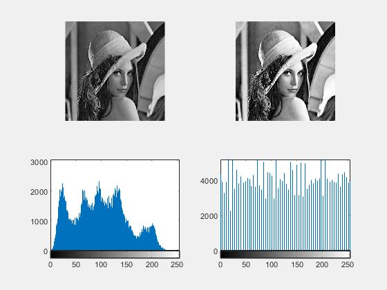

lena

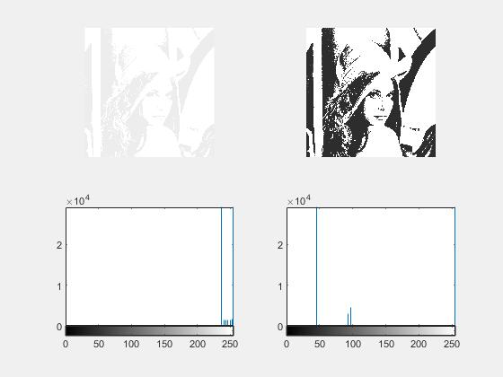

lena1

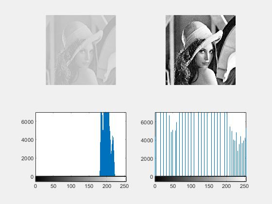

lena2

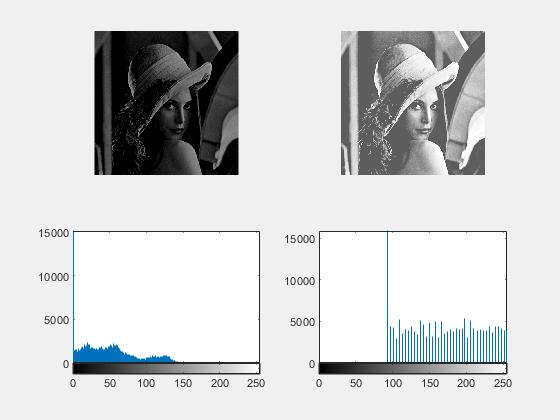

lena4

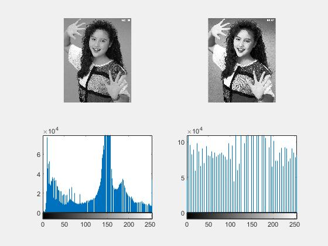

woman

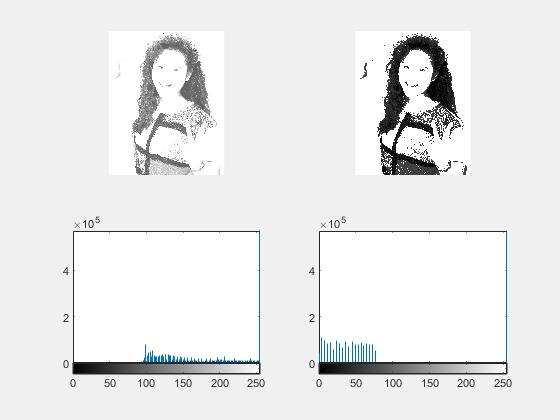

woman1

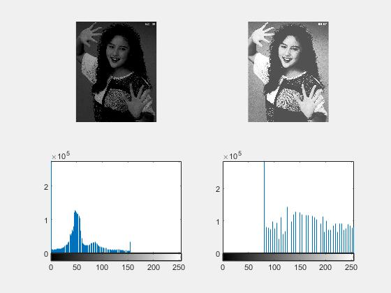

woman2

#### 结果分析

  从直方图的角度看，直方图均衡化确实使图像在整个灰度区间的分布更加均匀。从图像的角度进行观察，直方图均衡化使得原本色调偏暗或者偏亮的图像趋于正常，同时增大了对比度和细节的丰富程度。

### 第三题

#### 题目描述

进一步把图像按照对源图像直方图的观察，各自自行指定不同源图像的直方图，进行直方图匹配，进行图像增强；

#### 分析

  直方图匹配是将一个图像的直方图进行变换使之接近另一个图像的直方图。首先将两幅图像进行直方图均衡化，记录变换的函数，然后将目标图像的变换函数求反函数，使用此函数对待变换图像的直方图进行变换，即完成直方图匹配。

#### 结果

从左到右，从上到下，依次是目标图像， 待变换图像，变换结果，目标图像直方图，待变换图像直方图，变换结果直方图。

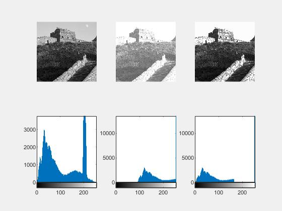

citywall1

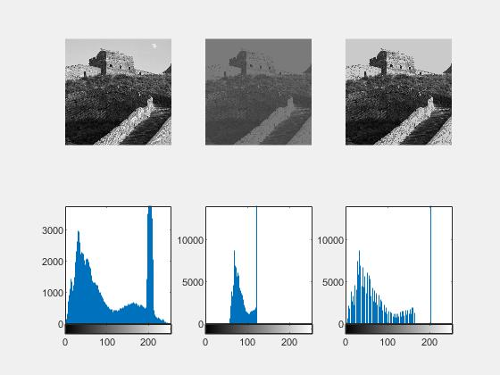

citywall2

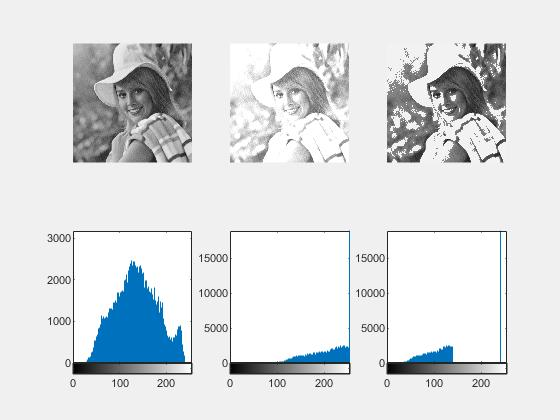

elain1

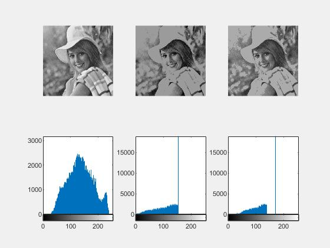

elain2

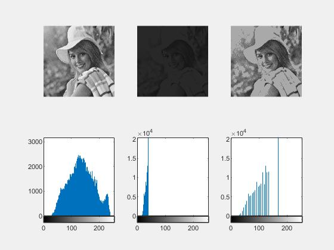

elain3

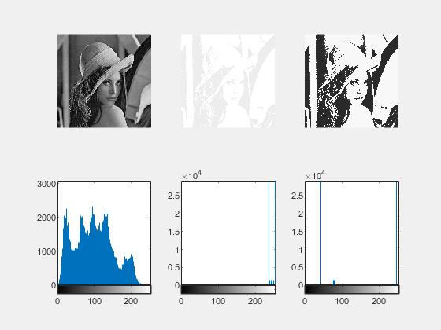

lena1

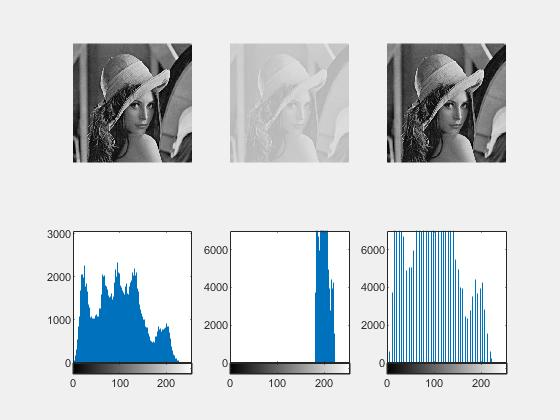

lena2

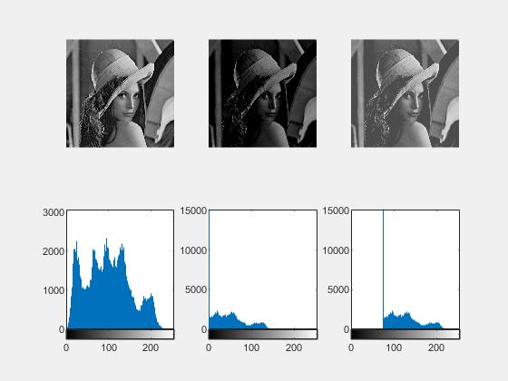

lena4

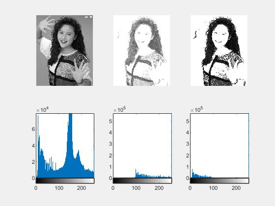

woman1

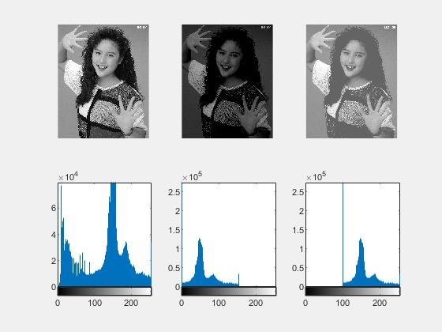

woman2

#### 结果分析

从直方图来看，直方图匹配确实使得直方图更接近目标图像，但是目标图像仍有较大差距。以较为正常的图片为目标进行直方图匹配使得原图像的质量更高，原本极其暗或极其亮的图像的直方图都更均匀的分布在灰度空间中，直方图匹配对于提升图像质量有所帮助，但是对目标图像的选取提出了一定的要求。

### 第四题

#### 题目描述

对elain和lena图像进行7*7的局部直方图增强；

#### 分析

  局部直方图增强是将原图像分为小块后在每个小块内部进行直方图匹配，方法为先分块，在分别进行直方图均衡化。使用matlab中的adapthisteq可实现此功能。

#### 结果

从左到右，从上到下，依次是原图像，局部增强图像，原图像直方图，局部增强图像直方图。

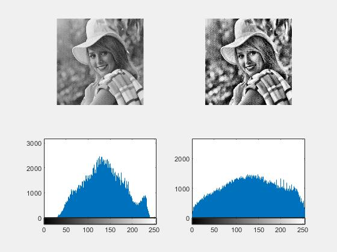

elain

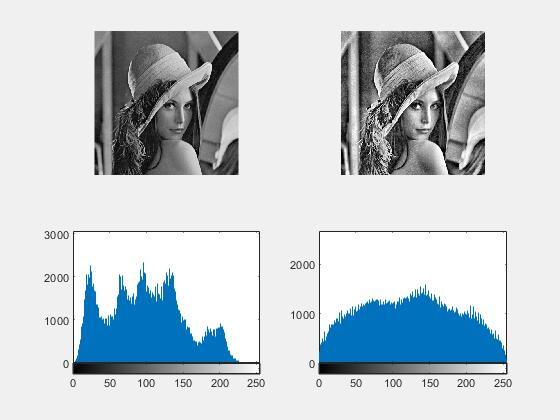

lena

#### 结果分析

  局部直方图增强与全局的直方图均衡相比有一定的优越性，对于某些特殊图像，例如大块部分被单一颜色占据，小部分包含丰富细节的图像，局部直方图增强对于这些部分的增强要好于全局增强，因为可以避免大块单一颜色的影响，更好地凸显局部。在本题目中，elain和lena的面部和头发的细节更丰富。

### 第五题

#### 题目描述

利用直方图对图像elain和woman进行分割；

#### 分析

首先画出直方图，然后挑选一个合适的灰度值作为阈值，据此阈值对原图像进行二值化处理。在查询资料后，发现大津法OTSU也即最大类间差方法在寻找阈值方面有很大优势。对于图像I(x,y)，前景(即目标)和背景的分割阈值记作T，属于前景的像素点数占整幅图像的比例记为ω0，其平均灰度μ0；背景像素点数占整幅图像的比例为ω1，其平均灰度为μ1。图像的总平均灰度记为μ，类间方差记为g。

假设图像的背景较暗，并且图像的大小为M×N，图像中像素的灰度值小于阈值T的像素个数记作N0，像素灰度大于阈值T的像素个数记作N1，则有：
　　　　　　ω0=N0/ M×N (1)
　　　　　　ω1=N1/ M×N (2)
　　　　　　N0+N1=M×N (3)
　　　　　　ω0+ω1=1　　　 (4)
　　　　　　μ=ω0*μ0+ω1*μ1 (5)
　　　　　　g=ω0(μ0-μ)^2+ω1(μ1-μ)^2 (6)
将式(5)代入式(6),得到等价公式:
　　　　　　g=ω0ω1(μ0-μ1)^2 　　 (7)　这就是类间方差
采用遍历的方法得到使类间方差g最大的阈值T,即为所求。

在matlab中有graythresh和im2bw来实现这一功能。

#### 结果

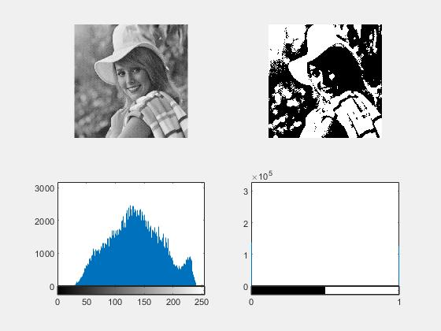

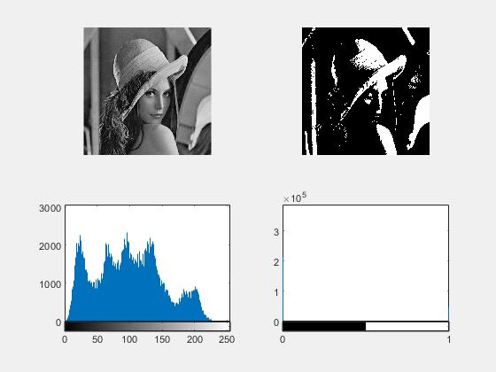

#### 结果分析

OTSU选取了阈值并对图像进行了分割，图像黑白部分分明，能够看出人物的轮廓。由于OTSU能够自动计算阈值从而避免了每次计算直方图后猜测阈值，较为方便。

